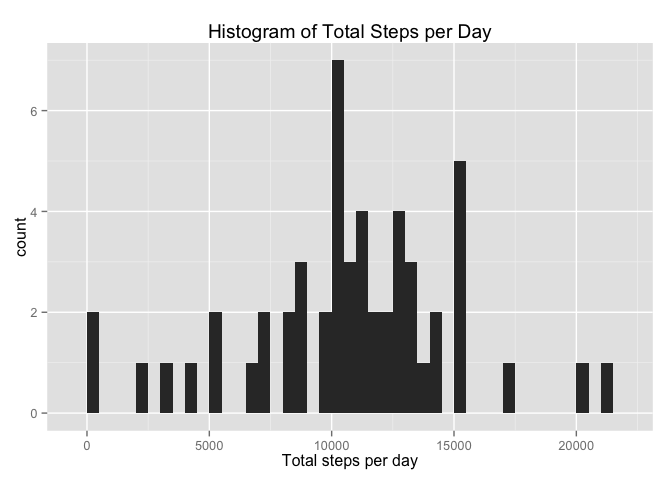
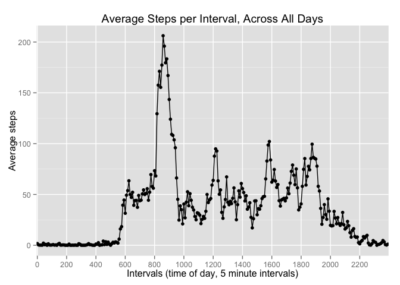

# Reproducible Research: Peer Assessment 1
John ARNZEN  

Please see [](README.md) for a description of this assignment. Also please note that not all of its content is the same as the more up-to-date assignment description on coursera.org---I've used the coursera content for step headings and labels.

**One last note**: the default directory for figures in my installation of R/RStudio + knitr is `PA1_template_files\figure-html\`, not `figures\` as mentioned in the assignment. I did not change this location.

## Loading and preprocessing the data

### 1. Load the data (i.e. read.csv())

**We assume** that `activity.zip` has been downloaded and its content (`activity.csv`) has been unzipped into the same directory as this R markdown file.

We load the data into a data table. Take a first look at the head and tail of it, and the column data types inferred by `fread()`.


```r
library(data.table, warn.conflicts = FALSE)
library(dplyr, warn.conflicts = FALSE)

(dt <- fread("activity.csv"))
```

```
##        steps       date interval
##     1:    NA 2012-10-01        0
##     2:    NA 2012-10-01        5
##     3:    NA 2012-10-01       10
##     4:    NA 2012-10-01       15
##     5:    NA 2012-10-01       20
##    ---                          
## 17564:    NA 2012-11-30     2335
## 17565:    NA 2012-11-30     2340
## 17566:    NA 2012-11-30     2345
## 17567:    NA 2012-11-30     2350
## 17568:    NA 2012-11-30     2355
```

```r
str(dt)
```

```
## Classes 'data.table' and 'data.frame':	17568 obs. of  3 variables:
##  $ steps   : int  NA NA NA NA NA NA NA NA NA NA ...
##  $ date    : chr  "2012-10-01" "2012-10-01" "2012-10-01" "2012-10-01" ...
##  $ interval: int  0 5 10 15 20 25 30 35 40 45 ...
##  - attr(*, ".internal.selfref")=<externalptr>
```

### 2. Process/transform the data (if necessary) into a format suitable for your analysis

We see that the `date` column is currently just a string, although it is in ISO date format. We convert that column to R's `Date` type, and then get a summary view of the data table's columns. We're particularly interested in the statistics for the `steps` column.


```r
dt$date <- as.Date(dt$date)
## dt <- dt %>% 
##     mutate(time = sprintf("%02d:%02d", interval %/% 100, interval %% 100))
summary(dt)
```

```
##      steps             date               interval     
##  Min.   :  0.00   Min.   :2012-10-01   Min.   :   0.0  
##  1st Qu.:  0.00   1st Qu.:2012-10-16   1st Qu.: 588.8  
##  Median :  0.00   Median :2012-10-31   Median :1177.5  
##  Mean   : 37.38   Mean   :2012-10-31   Mean   :1177.5  
##  3rd Qu.: 12.00   3rd Qu.:2012-11-15   3rd Qu.:1766.2  
##  Max.   :806.00   Max.   :2012-11-30   Max.   :2355.0  
##  NA's   :2304
```

NOTE the `NA's` count for `steps`. We'll verify that count below.

## What is mean total number of steps taken per day?

### 1. Calculate the total number of steps taken per day

We start addressing this question by creating and processing a new data table based on our initial data table.

We first strip all incomplete cases from original dataset---we do this so that we're dealing only with non-NA steps values in our statistics. Keeping the NA steps can affect the data in one of two ways:

* if the statistics parameter `na.rm = FALSE`, then the statistics will result in `NA` if it encounters any NAs, invalidating the statistic
* if the statistics parameter `na.rm = TRUE`, then dates with only NAs will return `0` (zero), which may not be correct and will increase the zero-bin count in the histogram

Either way our statistics will be skewed. While in our original data table it looks like all NAs occur in all intervals of certain days---meaning the day itself is effectively NA---there may be some chance that there's a `steps` value hidden amongst NAs for a day, so let's increase our chances of working with all valid data.

We then group the complete cases by `date` and then summarise the data into a new table containing dates and summations of steps per date. Just to spot-check the values in the new table, we get it's summary afterwards.


```r
(ts <- na.omit(dt) %>% 
     group_by(date) %>% 
     summarise(total_steps = sum(steps, na.rm = TRUE)))
```

```
## Source: local data table [53 x 2]
## 
##          date total_steps
##        (date)       (int)
## 1  2012-10-02         126
## 2  2012-10-03       11352
## 3  2012-10-04       12116
## 4  2012-10-05       13294
## 5  2012-10-06       15420
## 6  2012-10-07       11015
## 7  2012-10-09       12811
## 8  2012-10-10        9900
## 9  2012-10-11       10304
## 10 2012-10-12       17382
## ..        ...         ...
```

```r
summary(ts)
```

```
##       date             total_steps   
##  Min.   :2012-10-02   Min.   :   41  
##  1st Qu.:2012-10-16   1st Qu.: 8841  
##  Median :2012-10-29   Median :10765  
##  Mean   :2012-10-30   Mean   :10766  
##  3rd Qu.:2012-11-16   3rd Qu.:13294  
##  Max.   :2012-11-29   Max.   :21194
```

### 2. Make a histogram of the total number of steps taken each day

We use `ggplot2` to create the histogram (and other plots), assigning a `binwidth` to a range of 500 tallies to give us a decent granularity in the histogram.


```r
library(ggplot2, warn.conflicts = FALSE)

(p_ts <- ggplot(ts) + 
    geom_histogram(aes(total_steps), binwidth = 500) +
    labs(title = "Histogram of Total Steps per Day",
         x = "Total steps per day"))
```

 

### 3. Calculate and report the mean and median of the total number of steps taken per day

This is fairly straight forward to do. We'll save these values in variables so that we can reuse them later if needed.


```r
(ts_mean <- mean(ts$total_steps, na.rm = TRUE))
```

```
## [1] 10766.19
```

```r
(ts_median <- median(ts$total_steps, na.rm = TRUE))
```

```
## [1] 10765
```

Let's re-visualize the histogram from above with the median (solid red line) and mean (dashed red line) included.


```r
(p_ts_stats <- p_ts + 
    geom_vline(aes(xintercept = ts_median), color = "red", linetype = "solid") +
    geom_vline(aes(xintercept = ts_mean), color = "red", linetype = "dashed"))
```

 

In this case, the mean and median are so close that they essentially overlap in our plot.

## What is the average daily activity pattern?

### 1. Make a time series plot (i.e. type = "l") of the 5-minute interval (x-axis) and the average number of steps taken, averaged across all days (y-axis)

We start by creating a data table to answer this question, following a path similar to what we did for the histogram above.

We strip out all of the NAs from the original table, group the results by the `interval`s, and then create a new summarized table containing the average of each interval across all days. (Just for comparison, we also calculate the median of the steps per interval.)


```r
(it <- na.omit(dt) %>% 
     group_by(interval) %>% 
     summarise(avg_steps = mean(steps, na.rm = TRUE),
               median_steps = median(steps, na.rm = TRUE)))
```

```
## Source: local data table [288 x 3]
## 
##    interval avg_steps median_steps
##       (int)     (dbl)        (int)
## 1         0 1.7169811            0
## 2         5 0.3396226            0
## 3        10 0.1320755            0
## 4        15 0.1509434            0
## 5        20 0.0754717            0
## 6        25 2.0943396            0
## 7        30 0.5283019            0
## 8        35 0.8679245            0
## 9        40 0.0000000            0
## 10       45 1.4716981            0
## ..      ...       ...          ...
```

Let's get a look ranges and quantiles.


```r
summary(it)
```

```
##     interval        avg_steps        median_steps   
##  Min.   :   0.0   Min.   :  0.000   Min.   : 0.000  
##  1st Qu.: 588.8   1st Qu.:  2.486   1st Qu.: 0.000  
##  Median :1177.5   Median : 34.113   Median : 0.000  
##  Mean   :1177.5   Mean   : 37.383   Mean   : 3.962  
##  3rd Qu.:1766.2   3rd Qu.: 52.835   3rd Qu.: 0.000  
##  Max.   :2355.0   Max.   :206.170   Max.   :60.000
```

Now let's plot it out. Because the `interval`s are numeric representations of time of day (hours and minutes), `ggplot()` will think the intervals are continuous instead of discrete. This will introduce gaps in the graph between the 55 and the next hundred value. To get around this we coerce the intervals into a factor and then adjust the X-axis scale to show ticks for every 2 hours. To help with the visualization, we also include points on the line.


```r
ggplot(it, aes(as.factor(interval), avg_steps)) + 
    geom_line(aes(group = 1)) +
    geom_point() +
    scale_x_discrete(breaks = seq(0, 2400, 200)) +
    labs(title = "Average Steps per Interval, Across All Days",
         x = "Intervals (time of day, 5 minute intervals)",
         y = "Average steps")
```

 

### 2. Which 5-minute interval, on average across all the days in the dataset, contains the maximum number of steps?

We get the interval of interest by filtering the data table to where the maximum average occurs.


```r
it[avg_steps == max(avg_steps)]
```

```
## Source: local data table [1 x 3]
## 
##   interval avg_steps median_steps
##      (int)     (dbl)        (int)
## 1      835  206.1698           19
```

## Imputing missing values

### 1. Calculate and report the total number of missing values in the dataset (i.e. the total number of rows with NAs)

There are myriad ways of doing this. We'll use the facilities of our data table to tell us the count, using `data.table`'s special variable `.N` to give us the count of rows based on the row filter in the first indexing position.


```r
dt[is.na(steps), .N]
```

```
## [1] 2304
```

NOTE that this matches the NA count in the `summary(dt)` output above.

### 2. Devise a strategy for filling in all of the missing values in the dataset. The strategy does not need to be sophisticated. For example, you could use the mean/median for that day, or the mean for that 5-minute interval, etc.

We have a number of ways to accomplish this, and our strategy should look at where and how the NAs distribute within the data.

A quick manual perusal of the NAs, and calculations on their count compared to the overall data table, seems to indicate that the NAs occur in all intervals for certain days, effectively making the days themselves NA. Thus we have some consistency in the NA groupings.

We're still working with intervals per day though, so it wouldn't make much sense to use the daily average for each interval without severely skewing the results.

* We could divide the daily average by the number of intervals per day to distribute the average uniformly across the day. We could do the same with the daily median.
* We could fill the NAs with zero values, but then we'd be making assumptions that missing values mean no movement.
* We could use some form of mean or median for each interval to fill the NAs.
    * Using the interval means might work, but it might also affect the variance and standard deviation of the data adversely.
    * Using the interval medians might work better and be safer.
* We could also use a imputation library like `zoo` or `mice` and their functions, but that might defeat the purpose of doing this manually for this exercise.

For this assignment, let's use the **median steps per interval** that we calculated with the means above to fill in our NAs and see what happens.

### 3. Create a new dataset that is equal to the original dataset but with the missing data filled in.

We create a copy of the original data table because `data.table` seems to assign by reference rather than by value. With this copied data table, we iterate over it looking for NAs in the `step` column. If we find an NA, we copy the corresponding `interval` median steps value from the previously created steps-per-interval table (`it`).


```r
dt_filled <- copy(dt)

## There has to be a more functional and more efficient way to do this,
##   but I'm at a loss for it at the moment... advice appreciated :)
for (i in seq_len(nrow(dt_filled))) {
    if (is.na(dt_filled[i, steps])) {
        dt_filled[i]$steps <- it[interval == dt_filled[i, interval]]$median_steps
    }
}
```

Confirm we don't have any more NAs in the new data table.


```r
dt_filled[is.na(steps)]
```

```
## Empty data.table (0 rows) of 3 cols: steps,date,interval
```

Compare the summary for our filled data table with that of the original one to see how the statistics changed.


```r
summary(dt_filled)
```

```
##      steps          date               interval     
##  Min.   :  0   Min.   :2012-10-01   Min.   :   0.0  
##  1st Qu.:  0   1st Qu.:2012-10-16   1st Qu.: 588.8  
##  Median :  0   Median :2012-10-31   Median :1177.5  
##  Mean   : 33   Mean   :2012-10-31   Mean   :1177.5  
##  3rd Qu.:  8   3rd Qu.:2012-11-15   3rd Qu.:1766.2  
##  Max.   :806   Max.   :2012-11-30   Max.   :2355.0
```

```r
summary(dt)
```

```
##      steps             date               interval     
##  Min.   :  0.00   Min.   :2012-10-01   Min.   :   0.0  
##  1st Qu.:  0.00   1st Qu.:2012-10-16   1st Qu.: 588.8  
##  Median :  0.00   Median :2012-10-31   Median :1177.5  
##  Mean   : 37.38   Mean   :2012-10-31   Mean   :1177.5  
##  3rd Qu.: 12.00   3rd Qu.:2012-11-15   3rd Qu.:1766.2  
##  Max.   :806.00   Max.   :2012-11-30   Max.   :2355.0  
##  NA's   :2304
```

### 4. Make a histogram of the total number of steps taken each day, and calculate and report the mean and median total number of steps taken per day. Do these values differ from the estimates from the first part of the assignment? What is the impact of imputing missing data on the estimates of the total daily number of steps?

We follow the pattern used above to create the total steps histogram, but using our new filled/imputed steps data table.


```r
(ts_filled <- dt_filled %>%
    group_by(date) %>%
    summarise(total_steps = sum(steps)))
```

```
## Source: local data table [61 x 2]
## 
##          date total_steps
##        (date)       (int)
## 1  2012-10-01        1141
## 2  2012-10-02         126
## 3  2012-10-03       11352
## 4  2012-10-04       12116
## 5  2012-10-05       13294
## 6  2012-10-06       15420
## 7  2012-10-07       11015
## 8  2012-10-08        1141
## 9  2012-10-09       12811
## 10 2012-10-10        9900
## ..        ...         ...
```

Let's check the stats for the data, and compare it to the non-imputed total steps data from before.


```r
summary(ts_filled)
```

```
##       date             total_steps   
##  Min.   :2012-10-01   Min.   :   41  
##  1st Qu.:2012-10-16   1st Qu.: 6778  
##  Median :2012-10-31   Median :10395  
##  Mean   :2012-10-31   Mean   : 9504  
##  3rd Qu.:2012-11-15   3rd Qu.:12811  
##  Max.   :2012-11-30   Max.   :21194
```

```r
summary(ts)
```

```
##       date             total_steps   
##  Min.   :2012-10-02   Min.   :   41  
##  1st Qu.:2012-10-16   1st Qu.: 8841  
##  Median :2012-10-29   Median :10765  
##  Mean   :2012-10-30   Mean   :10766  
##  3rd Qu.:2012-11-16   3rd Qu.:13294  
##  Max.   :2012-11-29   Max.   :21194
```

Our imputed total steps data now looks like this:


```r
(p_ts_filled <- ggplot(ts_filled) +
    geom_histogram(aes(total_steps), binwidth = 500) +
    labs(title = "Histogram of Imputed Total Steps per Day",
         x = "Total steps per day"))
```

 

The only noticible difference is a new histogram column around 1000-1500 total steps.

Here are our imputed mean and median statistics:


```r
(ts_filled_mean <- mean(ts_filled$total_steps))
```

```
## [1] 9503.869
```

```r
(ts_filled_median <- median(ts_filled$total_steps))
```

```
## [1] 10395
```

Let's compare our imputed mean and median with the previous non-imputed mean and median. The non-imputed mean and median are the vertical grey dashed and solid lines respectively, and our imputed mean and median are the vertical red dashed and solid lines respectively.


```r
(p_ts_filled_stats <- p_ts_filled + 
    geom_vline(aes(xintercept = ts_filled_median), color = "red", linetype = "solid") +
    geom_vline(aes(xintercept = ts_filled_mean), color = "red", linetype = "dashed") +
    geom_vline(aes(xintercept = ts_median), color = "grey50", linetype = "solid") +
    geom_vline(aes(xintercept = ts_mean), color = "grey50", linetype = "dashed"))
```

 

We can see that imputing with the median steps reduced our mean and median somewhat, and increased the gap between their values.

Just for comparison, here are the non-imputed histogram and imputed histogram side-by-side.


```r
## adapted from Hadley Wickham's "ggplot2" book, p. 154
library(grid, warn.conflicts = FALSE)
pushViewport(viewport(layout = grid.layout(1, 2)))
vplayout <- function(x, y)
  viewport(layout.pos.row = x, layout.pos.col = y)
print(p_ts_stats + ylim(0,8), vp = vplayout(1, 1))
print(p_ts_filled_stats, vp = vplayout(1, 2))
```

 

## Are there differences in activity patterns between weekdays and weekends?

### 1. Create a new factor variable in the dataset with two levels – “weekday” and “weekend” indicating whether a given date is a weekday or weekend day.

We copy our original data table, adding new columns identifying the day of the week (`DOW`) for the `date`, and then categorizing those `DOW`s as either weekday or weekend in a new column for `day_type`. We then factorize those columns, including ordering the `DOW` factors from Sunday to Saturday.


```r
(dt_days <- dt %>%
    mutate(DOW = weekdays(date)) %>%
    mutate(day_type = ifelse(DOW %in% c("Saturday", "Sunday"), 
                             "weekend", 
                             "weekday")))

dt_days$DOW <- factor(dt_days$DOW, levels = c("Sunday", "Monday", "Tuesday", "Wednesday", "Thursday", "Friday", "Saturday"), ordered = TRUE)
dt_days$day_type <- as.factor(dt_days$day_type)
```

Let's take a peek at the structure and summary of our new data table to make sure it column types look good, and to see counts of weekdays vs. weekends in the data.


```r
str(dt_days)
```

```
## Classes 'data.table' and 'data.frame':	17568 obs. of  5 variables:
##  $ steps   : int  NA NA NA NA NA NA NA NA NA NA ...
##  $ date    : Date, format: "2012-10-01" "2012-10-01" ...
##  $ interval: int  0 5 10 15 20 25 30 35 40 45 ...
##  $ DOW     : Ord.factor w/ 7 levels "Sunday"<"Monday"<..: 2 2 2 2 2 2 2 2 2 2 ...
##  $ day_type: Factor w/ 2 levels "weekday","weekend": 1 1 1 1 1 1 1 1 1 1 ...
##  - attr(*, ".internal.selfref")=<externalptr>
```

```r
summary(dt_days)
```

```
##      steps             date               interval             DOW      
##  Min.   :  0.00   Min.   :2012-10-01   Min.   :   0.0   Sunday   :2304  
##  1st Qu.:  0.00   1st Qu.:2012-10-16   1st Qu.: 588.8   Monday   :2592  
##  Median :  0.00   Median :2012-10-31   Median :1177.5   Tuesday  :2592  
##  Mean   : 37.38   Mean   :2012-10-31   Mean   :1177.5   Wednesday:2592  
##  3rd Qu.: 12.00   3rd Qu.:2012-11-15   3rd Qu.:1766.2   Thursday :2592  
##  Max.   :806.00   Max.   :2012-11-30   Max.   :2355.0   Friday   :2592  
##  NA's   :2304                                           Saturday :2304  
##     day_type    
##  weekday:12960  
##  weekend: 4608  
##                 
##                 
##                 
##                 
## 
```

### 2. Make a panel plot containing a time series plot (i.e. type = "l") of the 5-minute interval (x-axis) and the average number of steps taken, averaged across all weekday days or weekend days (y-axis). (See the README file in the GitHub repository to see an example of what this plot should look like using simulated data.)

Because we're using the original data with NAs, we'll follow our previous pattern of omitting the NA rows. To get the requested averages, we first group by `day_type` (weekday or weekend) and then by `interval` as we did for average interval steps before. We can then get the average steps per interval per type of day.


```r
(dit <- na.omit(dt_days) %>%
    group_by(day_type, interval) %>%
    summarise(avg_steps = mean(steps)))
```

```
## Source: local data table [576 x 3]
## Groups: day_type
## 
##    day_type interval avg_steps
##      (fctr)    (int)     (dbl)
## 1   weekday        0 2.3333333
## 2   weekday        5 0.4615385
## 3   weekday       10 0.1794872
## 4   weekday       15 0.2051282
## 5   weekday       20 0.1025641
## 6   weekday       25 1.5128205
## 7   weekday       30 0.7179487
## 8   weekday       35 1.1794872
## 9   weekday       40 0.0000000
## 10  weekday       45 1.8461538
## ..      ...      ...       ...
```

For consistency, let's check out the summary info for our data.


```r
summary(dit)
```

```
##     day_type      interval        avg_steps      
##  weekday:288   Min.   :   0.0   Min.   :  0.000  
##  weekend:288   1st Qu.: 588.8   1st Qu.:  1.854  
##                Median :1177.5   Median : 26.295  
##                Mean   :1177.5   Mean   : 39.208  
##                3rd Qu.:1766.2   3rd Qu.: 62.321  
##                Max.   :2355.0   Max.   :234.103
```

We can now plot the interval averages per `day_type`. We use `ggplot2`'s facets to create the panel plot of weekday vs. weekend interval averages.


```r
ggplot(dit, aes(as.factor(interval), avg_steps)) +
    geom_line(aes(group = 1)) +
    scale_x_discrete(breaks = seq(0, 2400, 200)) +
    facet_grid(day_type ~ .) +
    labs(title = "Average Steps per Interval, Weekday vs. Weekend",
         x = "Intervals (time of day, 5 minute intervals)",
         y = "Average steps")
```

 
